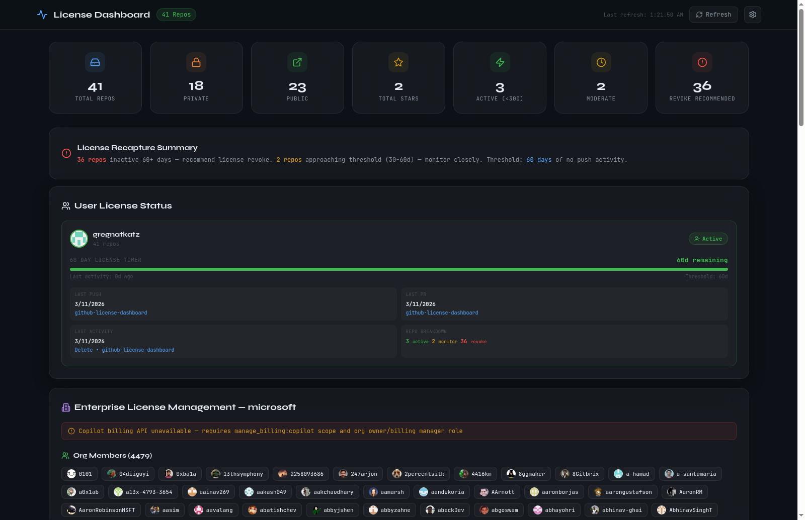
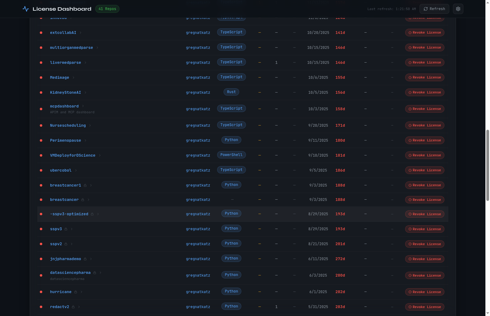

# GitHub License Activity Dashboard

Accurate GitHub license usage tracking for Copilot (Business & Enterprise) and GitHub Enterprise members. Identifies inactive users for license recapture using a **60-day inactivity threshold**.

## Demo

### Dashboard Overview — KPIs, User License Status, Enterprise Panel



**What you see:**
- **KPI cards:** 41 repos, 18 private, 23 public, 3 active, 2 moderate, 36 revoke recommended
- **User License Status** for gregnatkatz — 60-day countdown timer, last push/PR/activity dates, repo breakdown (3 active / 2 monitor / 36 revoke)
- **Enterprise License Management — microsoft** — Copilot billing scope error banner (expected without org admin token), 4,479 org members loaded with avatars

### Repos Table — Color-Coded License Recommendations



**What you see:**
- All 41 repos sorted by last push date with idle days
- Color-coded recommendations: green **Active** (<30d), yellow **Monitor** (30-60d), red **Revoke License** (60d+)
- Language tags, stars, forks, issues per repo

### License Manager Script (Mock Mode)

The `license_manager.py` script identifies inactive Copilot seats and handles license removal + Entra ID reassignment:

```
$ python license_manager.py --mock

  Step 1: Fetch Copilot Seat Assignments
  Org: mock-enterprise-org (mock)
  Loaded 20 mock seats

  Step 2: Categorize Seats by Activity
  Active   (<30d):  9 seats
  Monitor  (30-60d): 4 seats
  Reassign (>60d):  7 seats

  Step 4: Remove Inactive Copilot Seats
    [MOCK] Removed Copilot seat for: hank-legacy
    [MOCK] Removed Copilot seat for: ivy-contractor
    [MOCK] Removed Copilot seat for: jack-intern
    [MOCK] Removed Copilot seat for: kate-manager
    [MOCK] Removed Copilot seat for: leo-departed
    [MOCK] Removed Copilot seat for: olivia-mobile
    [MOCK] Removed Copilot seat for: rachel-design

  Step 5: Entra ID License Reassignment
    [MOCK] Found Entra user: hank-legacy@contoso.com
    [MOCK] Current licenses: Microsoft 365 E5, GitHub Enterprise
    [MOCK] Would disable GitHub Enterprise license for hank-legacy@contoso.com
    ... (7 users total)

  Summary:
  Total seats: 20 | Active: 9 | Monitor: 4 | Reassign: 7
```

---

## Live Dashboard

A React dashboard (dark glassmorphic theme) that visualizes repo and license data in real time from the GitHub API. Supports multiple accounts in a single view.

### Features

- **Multi-Account Support** — Add multiple GitHub PATs to view repos from different accounts in one dashboard
- **70+ Repo Overview** — KPI cards showing total repos, private/public split, stars, active/moderate/inactive counts
- **User License Status Panel** — Per-user activity cards showing:
  - Last Push date and repo
  - Last PR date and repo
  - Last Activity (any type) with date, type, and repo
  - 60-day countdown timer with visual progress bar
  - Status badge: Active (<30d) / Monitor (30-60d) / Revoke License (60d+)
  - Repo breakdown (active / monitor / revoke counts)
- **License Recapture Summary** — Banner showing how many repos are inactive 60d+ and approaching threshold
- **Per-Repo Recommendations** — Color-coded table with Active / Monitor / Revoke License per repo
- **Drill-Down Detail View** — Click any repo for contributor activity, commit charts, PR list, repo health
- **Token Health** — Rate limit bar, scope list, expiry countdown
- **Enterprise License Management** — Org-level Copilot seat tracking with:
  - Copilot billing summary (total/active/inactive/pending seats)
  - Per-seat activity table sorted by idle days
  - License reassignment recommendations (Active / Monitor / Reassign)
  - Org members list with Copilot seat status indicators
  - Org slug configuration in settings modal

### Running the Dashboard Locally

```bash
cd dashboard
npm install
npm run dev
```

Open `http://localhost:5173`, enter your GitHub PAT(s) in the settings modal, and the dashboard loads automatically.

### Building for Production

```bash
cd dashboard
npm run build
# Output in dashboard/dist/
```

---

## Python Scripts (Repo-Level Testing)

These scripts work with personal access tokens and don't require org admin credentials.

### Token Inspector

Validates a PAT and shows expiry, scopes, and rate limit usage.

```bash
pip install -r requirements.txt
export GITHUB_TOKEN=ghp_xxx
python token_inspector.py
```

### Repo Smoke Test

Pulls contributor activity from a single repo.

```bash
export GITHUB_TOKEN=ghp_xxx
python repo_test.py --repo owner/repo-name
```

---

## Enterprise Org-Level License Capture

> **This section is for organizations with GitHub Enterprise or Copilot Business/Enterprise plans.**
> Requires an org admin token with elevated scopes.

### What This Unlocks

The collector pulls directly from GitHub's APIs to get exact per-user last-active timestamps, enabling precise license usage tracking.

| Signal | What It Provides | Required Scope |
|--------|-----------------|----------------|
| **Copilot Seats API** | Per-user `last_activity_at` — actual IDE usage timestamp | `manage_billing:copilot` |
| **Enterprise Member List** | All members across the enterprise | `read:enterprise` |
| **Audit Log** | Real auth events (web, SSH, API, CLI) — highest trust signal | `read:audit_log` |
| **Org Member List** | All org members | `read:org` |

### Required Token Scopes

Create a **Classic PAT** with these scopes:

| Scope | Used For |
|-------|----------|
| `manage_billing:copilot` | Copilot seat list + `last_activity_at` |
| `read:org` | Org member list |
| `read:enterprise` | Enterprise member list |
| `read:audit_log` | Audit log — the most accurate activity signal |

**Easiest setup:** Classic PAT with `admin:enterprise` + `read:org` covers all of the above.

### How to Create the Token

1. Go to [github.com/settings/tokens](https://github.com/settings/tokens)
2. Click **Generate new token (classic)**
3. Select scopes: `admin:enterprise`, `read:org`, `manage_billing:copilot`
4. The token owner must be an **org owner** or **billing manager**
5. Copy the token — you won't see it again

### Running the Full Collector

```bash
cp config.example.yaml config.yaml
# Edit config.yaml with your org admin token, org slug, enterprise slug
python collector.py --config config.yaml --output github_license_report.json
```

This produces `github_license_report.json` with per-user data including:
- `effective_last_active` — the most recent timestamp across all signals
- `days_inactive` — days since last activity
- `recapture_candidate` — `true` if inactive 60+ days
- `source` — which signal provided the most recent activity (audit_log, copilot, member_list)

### Signal Merge Logic

The collector merges three signals per user and takes the **most recent** as `effective_last_active`:

1. **Audit Log** — real auth events (web, SSH, API, CLI) — **highest trust**
2. **Copilot Seats API** — actual IDE usage timestamp
3. **Enterprise member list** — existence only, no timestamp

A user inactive in Copilot but active in the audit log is **NOT** flagged for recapture. Audit log wins.

### Recapture Threshold

**60 days** of zero activity across all signals = recapture candidate.

Configurable via `--threshold` CLI arg or `threshold_days` in config.yaml.

### Running the AI Agent (Optional)

Feeds the license report into Claude API for a prioritized recapture plan.

```bash
export ANTHROPIC_API_KEY=sk-ant-xxx
python agent.py --report github_license_report.json
```

### License Manager Script (Copilot Removal + Entra ID Reassignment)

Automated script to identify inactive Copilot seats, remove licenses, and reassign via Microsoft Entra ID (Azure AD).

```bash
# Mock mode — see the full flow with sample data (no API calls)
python license_manager.py --mock

# Dry run against real GitHub org (reads only, no modifications)
python license_manager.py --org my-company --dry-run

# Live — remove inactive Copilot seats
python license_manager.py --org my-company

# With Entra ID integration for license reassignment
python license_manager.py --org my-company \
  --tenant-id <tid> --client-id <cid> --client-secret <cs> \
  --email-domain contoso.com

# Export inactive seats to CSV
python license_manager.py --org my-company --export inactive_seats.csv
```

**Modes:**
- `--mock` — Uses sample data with 20 mock users, no real API calls
- `--dry-run` — Connects to real APIs but doesn't remove or reassign anything
- (default) — Live mode, removes seats and reassigns licenses

**Entra ID Integration:**
- Authenticates via MSAL client credentials flow
- Matches GitHub logins to Entra ID users by UPN, email, or display name
- Removes GitHub/Copilot licenses from inactive users in Azure AD
- Can reassign freed licenses to new users
- Set `AZURE_TENANT_ID`, `AZURE_CLIENT_ID`, `AZURE_CLIENT_SECRET` env vars or pass via CLI

**To switch from mock to live with your Azure subscription:**
1. Create an Entra ID app registration with `User.ReadWrite.All` and `Directory.ReadWrite.All` permissions
2. Generate a client secret
3. Create a GitHub org admin PAT with `manage_billing:copilot` + `read:org`
4. Run: `python license_manager.py --org YOUR_ORG --tenant-id TID --client-id CID --client-secret CS`

### Enterprise Dashboard Integration

The React dashboard now includes a full **Enterprise License Management** panel that activates when you enter an org slug in the settings modal. It shows:

1. **Copilot Billing KPIs** — Total seats, active, inactive, pending cancellation
2. **Copilot Seats Table** — All seats with last activity, editor, idle days, plan type, assignment date, reassignment recommendation
3. **License Reassignment Summary** — Counts of seats that can be reassigned (60d+), need monitoring (30-60d), and are active
4. **Org Members View** — All org members with Copilot seat status, admin badges

Requires an org admin token with `manage_billing:copilot` + `read:org` scopes.

---

## Known Limitations

- **Audit log requires Enterprise plan** — if the org is on Team plan, this signal will 404 gracefully
- **Copilot billing endpoint** requires the org to have Copilot enabled and the token owner to be an org owner or billing manager
- **Rate limits** — the collector paginates with 200ms delay between pages. For 1000+ users, expect 2-5 minutes runtime
- **GitHub Events API** — only returns ~90 days of history for personal account activity tracking
- **Service accounts** — logins matching `bot-`, `svc-`, `ci-`, `-deploy` are flagged as `enterprise_review` not auto-recapture
- **Fine-grained PATs** — scope validation is skipped since GitHub doesn't expose scopes in response headers for fine-grained tokens

---

## Security

- Tokens are stored in React state only — never persisted to localStorage or disk
- No tokens are committed to this repository
- Always expire tokens after testing

---

## Project Structure

```
github-license-dashboard/
  README.md                  # This file
  license_manager.py         # Copilot license removal + Entra ID reassignment
  collector.py               # Full org/enterprise license collector
  agent.py                   # Claude AI recapture plan generator
  token_inspector.py         # PAT validation and diagnostics
  repo_test.py               # Single-repo smoke test
  config.example.yaml        # Config template
  requirements.txt           # Python dependencies (requests, pyyaml, msal)
  dashboard/                 # React dashboard
    src/App.tsx              # Main dashboard application (3200+ lines)
    src/App.css              # Styles
    package.json             # Node dependencies
    vite.config.ts           # Build config
```

---

Built by Gregory Katz. Reach out before making changes to the recapture logic or auto-removal flow in `agent.py`.
